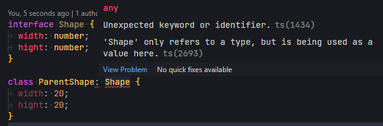
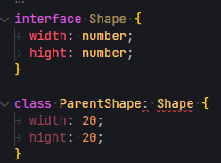
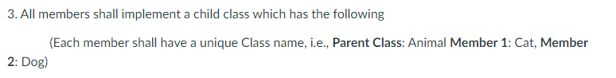

# Valorant Guns OOP Practice

## A project by Burgershot Crew

## notes

### Note001 - Force Override keyword

- Override keywords are forced in child classes
  - tsconfig.json option `"noImplicitOverride": true`

### Ratings

- Jerome: 4/4 this activity boosted my knowledge
- Jam: 4/4 'twas fun collaborating with my group

### Mistakes

1. An interface cannot be used in a parent class without the implements keyword.  
     
     
     
